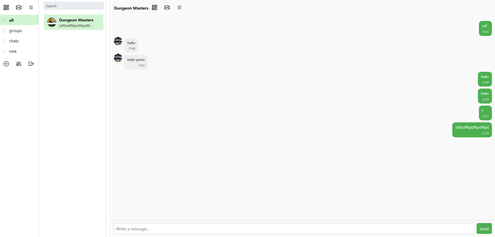

# Prost

**Prost** is a simple messenger project inspired by\
https://github.com/notarious2/fastapi-chat/

> ⚠️ This is a raw, experimental project.\
> Overengineered in some parts and built mainly for learning/testing
> purposes.



------------------------------------------------------------------------

## ✨ Features

-   Authentication (JWT + refresh)
-   Chats & Groups
-   Folders for chat organization
-   Join Requests & Invitations
-   Search (powered by Elasticsearch)
-   Real-time messaging (WebSockets)

------------------------------------------------------------------------

## 🧱 Tech Stack

### Backend

-   FastAPI
-   PostgreSQL
-   Redis (caching)
-   Elasticsearch (search)
-   MinIO (file storage)

### Frontend

-   Vue 3
-   Vite
-   Axios
-   Pinia

------------------------------------------------------------------------

## 🚀 Installation

### 1. Clone repository

``` bash
git clone https://github.com/Pawelgit1234/prost
cd prost
mv .env.example .env
```

### 2. Commands (2 termianls)

#### 1 Terminal
``` bash
npm install
npm run dev
```

#### 2 Terminal
``` bash
docker compose up --build
```
